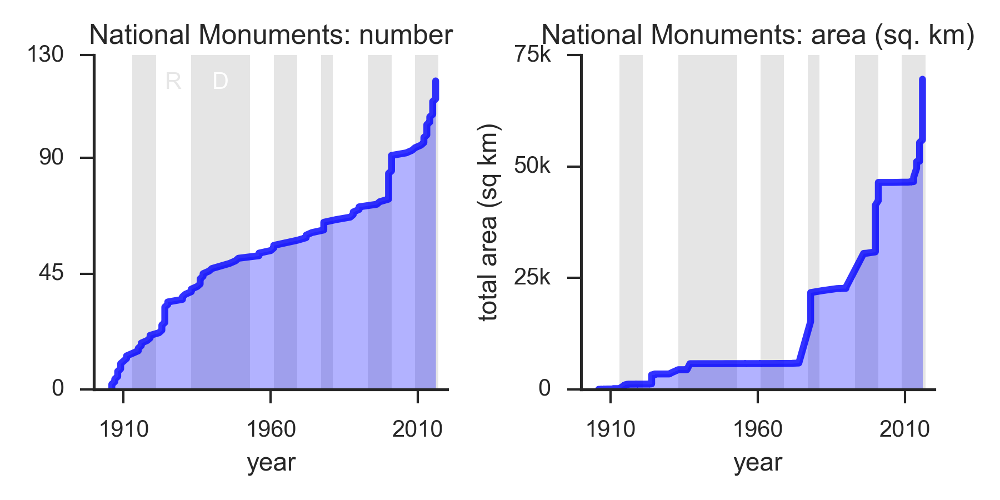

# National Protected Lands
Last updated: 2016-12-31

President Obama recently announced the addition of two more National Monuments.
I was curious about the number of such lands and the total area designated as
such.  I searched around for some available data sets with the information
I needed, but didn't find anything already in CSV or other readily machine
readable format.  So I constructed my own (see section below for file
descriptions and purposes).

Orinally I set out the answer a couple of minor questions, and was open to the
idea of additional questions presenting themselves as I went along.

* How many National Monuments are there?  How much area do they cover?
* When were these lands designated, and by who?

A follow up question that readily presented itself (the data was easier to
acquire than my original target): 

* How do National Monuments compare to National Parks?

I produced the following two paires of figures:

**Figure 1** Increasing number and area of land protected as **National Parks** in the
United States.  Left figure shows the cumulative number of National Parks over
time.  The gray shaded areas indicate Democratic Presidential Administrations
(marked with 'D'), and the unshaded background areas indicate Republican
Presidential Administrations (marked with 'R').  The right figure is a area of
land protected as National parks in square kilometers over time.  The shaded
areas are the same.

**Figure 2** The increasing number and area of land protected as **National
Monuments**.  Note that these figures _excludes four marine monuments_.  In
general, the description of the figures is basically the same as Fig. 1.

Two features are interesting in the above figures.  First, National Parks
increase in number and area at a fairly consistent rate regardless of which
party the President belongs to.  I'm not sure how to categorize the outlier
event of the addition of several large parks in Alaska on 1980-12-02. National
Monuments outnumber Parks by 2:1, and their rate of addition was relatively
consistent until the most recent Democratic Presidencies.

Less obvious in these figures, but when you start to drill into some of the
chart particulars, a third feature emerges. If the largest tracts are excluded
(Alaskan National Parks, mainly, and marine National Monumenets) the two
designated areas approximately equal scales (about 100k square kilometers).

## Files

- [National Lands (share).ipynb](National Lands \(share\).ipynb): Main event,
  should only need to run this notebook to get the above figures.
- [load_nps.ipynb](load_nps.ipynb): Called by above to import and preprocess the
  National Park dataset.
- [load_nm.ipynb](load_nm.ipynb): same as above, but for National Monuments.
- [Scrape National Moments From Wikipedia.ipynb](Scrape National Moments From
  Wikipedia.ipynb): There was no readily available and complete list of National
  Monuments that included both their area and their designation date.  So I made
  it.  It should not be necessary to run this notebook since it outputs
  [national_monuments_areas.pkl](national_monuments_areas.pkl), which is
  included.
- [national_monuments_wikipedia.csv](national_monuments_wikipedia.csv):
  Copy/paste of the [List of National Monuments in
  Wikipedia](https://en.wikipedia.org/wiki/List_of_National_Monuments_of_the_United_States).
- [national_parks_wikipedia.csv](national_parks_wikipedia.csv): Same, but for
  National Parks.
- [presidents.csv](presidents.csv): List of US Presidents with the start and end
  dates of their term, and which party they belong(ed) to, categorized as
  Democrat, Repbulican, or Other.

## Further lines of inquiry

- How do these breakdown by annual cost?
  - What is the money spent on?
  - What is the money not spent on?  What is going not done due to congressional
    budget choices?
  - Did they cost anything to start/buy?
  - Deeper look at funding/costs.
- Park visitors over the years? Park visitors during the year?
  - Is it possible to correlated visitors and local weather?
- Where are they located?  What is their relative area with respect to the state
  that they are located in?
- How long does it take to designate a park?  (How) Do they grow over time?
- Not really related to land designation, but what about roadside markers?
  Where are these located?
